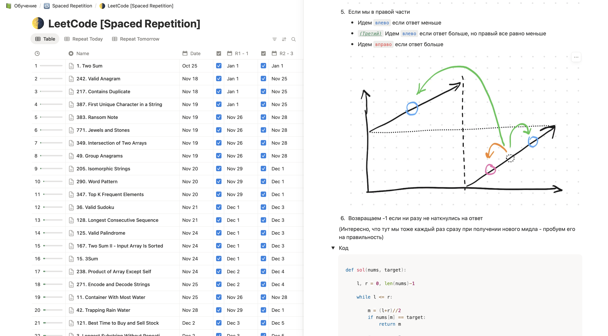

## 🧠 Knowledge Base (Notion)

My primary learning system lives in Notion and acts as a structured database:

- spaced repetition schedule
- first solve / review dates
- confidence tracking
- step-by-step explanations in Russian
- final reference implementations

👉 View the Notion dashboard: [Notion Link](https://www.notion.so/2b95a0eb51d8802398caf81d22404107?v=2b95a0eb51d881d99391000cdd72696c)

